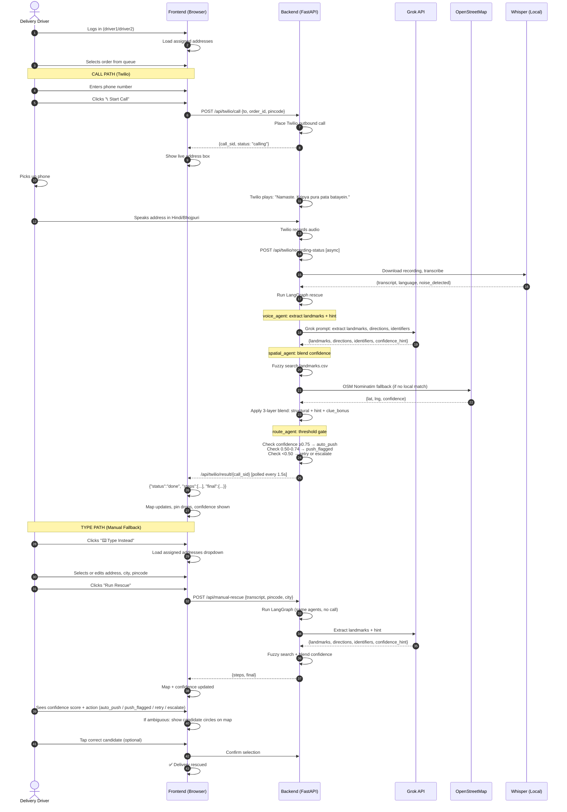
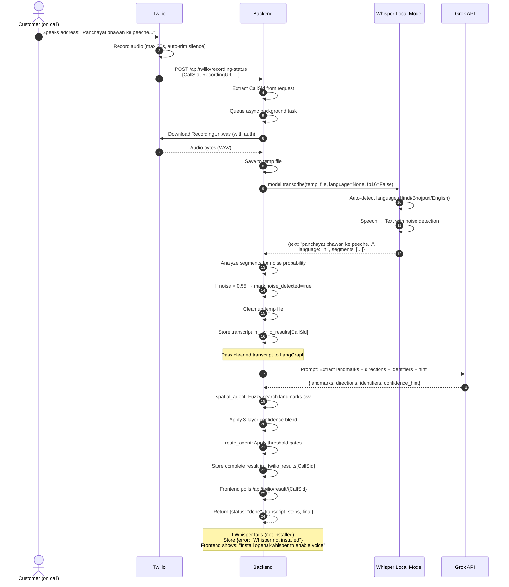

# Delivery_Rescue
RTO Project
ScriptedByHer[2.0] | Theme: Building for Bharat with Agentic AI

# Delivery Rescue — Agentic AI for Last-Mile Delivery
### Voice-to-GPS · Real-time Orchestration · Tier 2/3 India

> *"Address is not where you live. It's whether the world can reach you."*

---

## Table of Contents

1. [Project Overview](#1-project-overview)
2. [The Problem We Solve](#2-the-problem-we-solve)
3. [Our Solution](#3-our-solution)
4. [Architecture Diagram](#4-architecture-diagram)
5. [Agentic AI Design](#5-agentic-ai-design)
6. [LangGraph Flow Diagram](#6-langgraph-flow-diagram)
7. [Request / Response Flow](#7-request--response-flow)
8. [File Structure & What Each File Does](#8-file-structure--what-each-file-does)
9. [Landmark Database Design](#9-landmark-database-design)
10. [Libraries & Open Source Tools](#10-libraries--open-source-tools)
11. [How to Set Up and Run](#11-how-to-set-up-and-run)
12. [Twilio Integration (Real Calling)](#12-twilio-integration-real-calling)
13. [API Reference](#13-api-reference)
14. [Demo Scenarios](#14-demo-scenarios)
15. [Edge Cases Handled](#15-edge-cases-handled)


*Switched to Grok due to credit limit.*
---

## 1. Project Overview

**Delivery Rescue** is a multi-agent AI system that intercepts failing deliveries
in real time — the moment a delivery partner marks an address as unclear — and
resolves the location autonomously in under 90 seconds without any human operator.

| Stat | Value |
|------|-------|
| Target reduction in RTOs | 9 percentage points |
| Time to resolution | < 90 seconds |
| Human intervention required | Zero |
| Languages supported | Hindi, Bhojpuri, English |
| Cities in landmark database | 41 real locations (16 Tier 2/3 cities) |
| States covered | Bihar, UP |

---

## 2. The Problem Statement

### India's addressing crisis

Over **500 million Indians** have no structured address. They navigate using
landmarks — temples, schools, chowks, bus stands — with directions like:

> *"Hanuman Mandir ke peeche, teesra ghar, neeli deewar"*
> *(Behind the Hanuman Temple, third house, blue wall)*

This causes:
- **20–30%** of COD e-commerce orders to fail and return (RTO)
- **₹80–200** lost per RTO (forward + reverse logistics)
- Sellers losing income, buyers losing trust, delivery partners not getting paid

### Why existing solutions fail

| Solution | When it runs | Why it's insufficient |
|----------|-------------|----------------------|
| Order-time geocoding (e.g. GeoIndia) | At checkout | Makes a static prediction once; can't handle "near the yellow gate" |
| Generic IVR calls | On failure | English/Hindi only, no landmark extraction, no GPS update |
| Manual ops escalation | After all attempts fail | Slow, expensive, doesn't scale |
| **Our system** | **At the moment of failure, at the door** | **Real-time voice → GPS in 90 seconds** |

### The ambiguity problem

The same landmark name exists **multiple times** in every Tier 2/3 city:

| City | Landmark | Count in city |
|------|----------|---------------|
| Muzaffarpur | "Hanuman Mandir" | 4 different temples |
| Varanasi | "Shiv Mandir" | 18 different temples |
| Gorakhpur | "Panchayat Bhawan" | 22 different offices |

A static geocoder returns the first result. Our system **detects ambiguity, shows candidates on the map** and let driver tap the right one or **asks a clarifying question** in the customer's own dialect, and resolves it.

---

## 3. Our Solution

*Switched to Grok due to credit limit.*

A **3-agent agentic AI system** orchestrated by LangGraph:
*Real-time voice → GPS resolution*
```
Driver taps "Address Unclear"
        │
        ▼
┌────────────────────────────────────────────────────────┐
│           LangGraph Multi Agent Orchestrator           │
│                                                        │
│  ┌─────────────┐    ┌──────────────┐    ┌──────────┐   │
│  │ Voice Agent │──▶│ Spatial Agent│──▶ │  Route   │   │
│  │             │    │              │    │  Agent   │   │
│  │ • Calls in  │    │ • Local CSV  │    │ • ≥75%   │   │
│  │   dialect   │    │ • Fuzzy      │    │   auto-  │   │
│  │ • Whisper   │    │ • OSM fallbk │    │   push   │   │
│  │   ASR       │    │ • Ambiguity  │    │ • 50-75% │   │
│  │ • Grok      │    │   detection  │    │   flag   │   │
│  │   extract   │    │ • Confidence │    │ • <50%   │   │
│  └─────────────┘    │   scoring    │    │   retry  │   │
│         ▲           └──────────────┘    └──────────┘   │
│         │                                    │         │
│         └────── retry_voice ◀──── low conf ──┘        │
│                                    │                   │
│                              ┌─────▼─────┐             │
│                              │ Escalate  │             │
│                              │ (≥3 fail) │             │
│                              └───────────┘             │
└────────────────────────────────────────────────────────┘
        │
        ▼
Driver's map pin updates. Delivery saved.
```

---

## 4. Architecture Diagram

```
┌──────────────────────────────────────────────────────┐
│               FRONTEND (Browser)                     │
│  ┌─────────────┐  ┌──────────────┐  ┌────────────┐   │
│  │Driver Login │  │Rescue Queue  │  │Agent Trace │   │
│  │(2 accounts) │  │(per-driver)  │  │(live flow) │   │
│  └─────────────┘  └──────────────┘  └────────────┘   │
│                                                      │
│  ┌────────────────────────────────────────────────┐  │
│  │ Rescue Console (tabs: Call | Type Instead)     │  │
│  │ ┌──────────────────────────────────────────┐   │  │
│  │ │ 📞 CALL (Twilio) | ⌨️ TYPE (Fallback)   │   │  │
│  │ └──────────────────────────────────────────┘   │  │
│  │ [Phone Input] [Address Dropdown]               │  │
│  │ [Live Address Display while Calling]           │  │
│  │ [Agent Activity Log]                           │  │
│  └────────────────────────────────────────────────┘  │
│                                                      │
│  ┌────────────────────────────────────────────────┐  │
│  │  Live Leaflet Map                              │  │
│  │ • Blue candidate circles (ambiguous matches)   │  │
│  │ • Green pin (resolved location)                │  │
│  │ • Confidence speedometer                       │  │
│  │ • "Open in Google Maps" link                   │  │
│  └────────────────────────────────────────────────┘  │
└──────────────────────────────────────────────────────┘
             ↕ WebSocket, HTTP/REST
┌──────────────────────────────────────────────────────┐
│        BACKEND (FastAPI + LangGraph)                 │
│                                                      │
│  ┌──────────────────────────────────────────────┐    │
│  │       LangGraph StateGraph                   │    │
│  │  voice_agent → spatial_agent → route_agent   │    │
│  │       ▲                            │         │    │
│  │       └────── retry_voice ─────────┘         │    │
│  │                         └→ escalate_node     │    │
│  └──────────────────────────────────────────────┘    │
│                                                      │
│  API Endpoints:                                      │
│  • /api/twilio/call       — Outbound Twilio call     │
│  • /api/twilio/result/    — Poll for call result     │
│  • /api/manual-rescue     — Typed address fallback   │
│  • /api/geocode           — Test spatial agent       │
│  • /api/health            — System status            │
│                                                      │
│  Integrations:                                       │
│  • Grok   API (Landmark extraction)                  │
│  • Whisper (Speech → Text)                           │
│  • OSM Nominatim (Geocoding fallback)                │
│  • Twilio (Real phone calls, optional)               │
└──────────────────────────────────────────────────────┘
```

---

## 5. Agentic AI Design

### Why this is genuinely "agentic" (not just a pipeline)

A pipeline always runs A→B→C in the same order.
An agentic system **makes decisions** based on what's happening.

```
What makes it agentic:

1. SHARED STATE (not API calls between agents)
   ┌──────────────────────────────────────┐
   │ RescueState (TypedDict)              │
   │  order_id, raw_address, pincode      │
   │  audio_transcript    ← voice writes  │
   │  extracted_landmarks ← voice writes  │
   │  geocode_result      ← spatial writes│
   │  confidence_score    ← spatial writes│
   │  final_gps           ← route writes  │
   │  retry_count, status, error_log      │
   └──────────────────────────────────────┘
   Agents never call each other.
   They write to state. Orchestrator decides what runs next.

2. CONDITIONAL ROUTING (the brain)
   routing_decision(state) → one of:
     "end"         if resolved
     "escalate"    if retry_count ≥ 3
     "retry_voice" if confidence < 0.50 and retries remain

3. LOOP-BACK CAPABILITY
   Voice Agent can run multiple times in a single rescue.
   Each time: better transcript, more specific question asked.

4. GRACEFUL DEGRADATION
   LLM fails → keyword fallback (still works)
   OSM unreachable → local CSV only (still works)
   Call unanswered → WhatsApp fallback (still works)
   3 total failures → human escalation (never silent fail)
```

### Confidence Thresholds
 
| Score | Action | Escalation |
|-------|--------|------------|
| ≥ 0.75 | AUTO-PUSH | GPS sent to driver immediately |
| 0.50–0.74 | PUSH+FLAG | GPS sent, ops team notified for review |
| 0.25–0.49 | RETRY | Loop back to Voice Agent, ask for detail |
| < 0.25 | ESCALATE | Human ops intervention |
 
---
## 6. Confidence Scoring — Three-Layer Model
### Layer 1: Structural Match (Fuzzy Landmark Search)
 
| Signal | Weight | Description |
|---|---|---|
| **Landmark name** | $\max(0.35 \times \text{exact}, 0.35 \times \text{fuzzy})$ | Catches "mandhir" ↔ "mandir" spelling drift via `difflib.SequenceMatcher` |
| **Alias match** | +0.15 each | Alternative names, colloquial tags |
| **Pincode exact** | +0.25 | Postal code from order matches CSV |
| **City/district** | +0.15 | Broader geographic region |
| **Ambiguity flag** | −0.10 | CSV notes "multiple/ambiguous" landmarks |
| **Ambiguity detected** | ×0.55 | 2+ candidates within 0.12 score gap → halve confidence & show all candidates on map |

*OSM - OpenStreetMap*

### Ambiguity detection

When the local landmark CSV contains multiple entries with similar names
in the same city, the scoring algorithm detects this and halves confidence:

```python
close_matches = [s for s, _ in scored if s >= top_score - 0.12]
if len(close_matches) > 1:
    top_score *= 0.55   # ambiguity penalty
```

This forces a retry where the Voice Agent asks a more specific question.

### Layer 2: LLM Self-Confidence (New — Previously Unused)
 
Grok now **reports its own extraction confidence** in the JSON response:
*Switched to Grok due to credit limit.*
 
| Hint | Value | When |
|---|---|---|
| `high` | 0.90 | Clear landmark, good signal |
| `medium` | 0.60 | Some ambiguity in transcript |
| `low` | 0.30 | Vague/unclear; keyword fallback used |
 
**Benefit:** System is honest about degradation. If Whisper fails or LLM is unavailable, score drops automatically.
 
### Layer 3: Clue Richness (New — Rewards Detail)
 
Customer provides directional & visual clues
 
**Directions:** "peeche" (behind), "baaju mein" (next to), "saamne" (in front)  
**Identifiers:** "neeli deewar" (blue wall), "peela gate" (yellow gate), "teesra ghar" (third house)
 
**Benefit:** Encourages customer detail; rewards it with higher confidence.
 
### Final Blended Formula
 
$$\text{confidence} = 0.75 \times \text{structural} + 0.15 \times \text{hint\_value} + \text{clue\_bonus}$$
 
Then apply dampeners:
 
| Condition | Dampener |
|-----------|----------|
| Noise detected | ×0.82 (local) / ×0.80 (OSM) |
| Retry in progress | Cap at 0.72 (local) / 0.60 (OSM) |
| OSM fallback | ×0.75, capped 0.68 |
 
**Worked example:**
```
Transcript: "Panchayat bhawan ke peeche teesra ghar neeli deewar"
 
Structural: 0.35 (landmark) + 0.25 (pincode) + 0.15 (city) = 0.75
LLM hint: "high" = 0.90
Clues: 2 directions + 2 identifiers = 4 clues → bonus 0.06
 
confidence = 0.75 × 0.75 + 0.15 × 0.90 + 0.06
           = 0.5625 + 0.135 + 0.06
           = 0.7575 → 76% → PUSH+FLAG
```
 
---
 
## 7. LangGraph Flow
 
```
START
  │
  ▼
voice_agent
  • Call customer (Twilio or mock)
  • Whisper transcription
  • Grok landmark extraction + hint
  • Noise cleaning
  │
  ▼
spatial_agent
  • Fuzzy search landmarks.csv
  • Detect ambiguity, surface candidates
  • OSM fallback
  • Blend confidence (3-layer model)
  │
  ▼
route_agent
  • Apply thresholds (75%, 50%, <25%)
  • Decide: auto_push | push_flagged | retry | escalate
  │
  ├─→ ≥0.75 → END (auto-push)
  ├─→ 0.50–0.74 → END (push+flag)
  ├─→ <0.50 & retry<3 → RETRY (loop back to voice_agent)
  └─→ retry≥3 → escalate_node → END
```

---

## 7. Request / Response Flow

### Full sequence: from driver tap to GPS delivered


Install `Mermaid` to view this diagram.

### Audio transcription flow


Install `Mermaid` to view this diagram.

---

## 8. File Structure & What Each File Does

```
delivery-rescue/
│
├── backend.py                Main FastAPI app + LangGraph agents
│                             Real Twilio integration + mock fallback
│                             Run: uvicorn backend:app --port 8000
│
├── index.html                Full frontend: driver login, queue, rescue console
│                             Two tabs: 📞 Call (Twilio) | ⌨️ Type Instead
│                             Live Leaflet map, confidence meter
│                             No external server needed for HTML
│
├── landmarks.csv             41 real landmark entries (39 after dedup)
│                             16 Tier 2/3 cities across Bihar/UP
│                             Fuzzy-searchable CSV
│
├── requirements.txt          Python packages (FastAPI, LangGraph, Twilio, etc.)
│
└── README.md                 Working Flow, Description, Formulas, Logic
```

### `backend.py`

| Lines | Section | Purpose |
|-------|---------|---------|
| 1–30 | Imports + setup | FastAPI, LangGraph, Twilio client init |
| 51–120 | Landmark loading | CSV → token index for fuzzy search |
| 125–290 | `_fuzzy_ratio()` & `_local_search()` | Fuzzy matching + 3-layer confidence blend |
| 295–325 | `RescueState` TypedDict | Shared state schema |
| 327–495 | `voice_agent()` | Call, transcription, Grok extraction, confidence_hint |
| 497–660 | `spatial_agent()` | Fuzzy search, ambiguity detection, blended confidence |
| 662–750 | `route_agent()` | Threshold gates, push/flag/retry/escalate logic |
| 752–800 | `/api/twilio/call` | Outbound Twilio call endpoint |
| 801–850 | `/api/twilio/recording-status` | Async callback: download, Whisper, run LangGraph |
| 851–900 | `/api/manual-rescue` | Typed address fallback (no call needed) |
| 901–950 | Health + geocode endpoints | System status, direct spatial agent test |

### Inside `landmarks.csv` — column meanings

| Column | Meaning |
|--------|---------|
| `landmark_name` | What the customer says ("Hanuman Mandir") |
| `alias_1`, `alias_2` | Other names same landmark is called |
| `raw_address_example` | Real example of how an address is given |
| `city`, `district`, `state` | Geographic location |
| `pincode` | India Post pincode for this area |
| `lat`, `lng` | Coordinates (verified from government/OSM sources) |
| `landmark_type` | temple / transport / government / education / medical / shop |
| `ambiguity_level` | LOW / MEDIUM / HIGH / VERY HIGH |
| `same_name_count_in_city` | How many identical-name landmarks in same city |
| `ambiguity_note` | Why this is ambiguous — shown to ops team |
| `distinguishing_clue_needed` | What to ask the customer to resolve ambiguity |

---

## 9. Landmark Database Design

### Why CSV and not a database?

For this prototype: CSV is the right choice.
- Zero setup — no Postgres/MongoDB installation needed
- Git-friendly — can be edited in Excel/Google Sheets
- Portable — works anywhere Python runs
- Fast enough — 41 rows searched in microseconds

### How to expand the database

Open `landmarks.csv` in Excel or Google Sheets and add rows. Rules:
1. One row = one specific physical location
2. If same landmark name exists 3 times in a city → add 3 rows, each with different lat/lng
3. Set `ambiguity_level` honestly — this drives confidence scoring

### Columns
 
| Column | Meaning |
|--------|---------|
| `landmark_name` | What customer says |
| `alias_1`, `alias_2` | Alternative names |
| `city`, `district`, `state` | Geography |
| `pincode` | India Post code |
| `lat`, `lng` | Coordinates |
| `landmark_type` | temple / shop / transport / government / etc. |
| `ambiguity_note` | Why ambiguous (shown to ops if flagged) |
 
---

### How the fuzzy search works

```
Input: ["Hanuman Mandir", "842001"]
         │
         ▼
Tokenize: {"hanuman", "mandir", "842001"}
         │
         ▼
For each row in landmarks.csv:
  - Overlap with landmark_name tokens → +0.35
  - Overlap with alias tokens          → +0.15 each
  - Pincode exact match               → +0.25
  - City/district name match          → +0.15
  - "multiple/ambiguous" in note      → -0.10
         │
         ▼
Sort by score. Top result returned.
If 2+ results within 0.12 of each other → AMBIGUOUS → confidence *= 0.55
```

---

## 10. Libraries & Open Source Tools

### Backend

| Library | Version | Purpose | Why chosen |
|---------|---------|---------|------------|
| **FastAPI** | 0.115 | Web framework + WebSocket | Async-native, auto API docs, fastest Python web framework |
| **LangGraph** | 0.2.28 | Multi-agent orchestration | State machine + conditional routing + loops — only framework that does this properly |
| **langchain-core** | 0.3.8 | LangGraph dependency | Provides base types and utilities |
| **Grok API** | 1.30.0 | Grok API client | Grok is fast and cheap for landmark extraction |
| **httpx** | 0.27.2 | Async HTTP client | Used for OSM Nominatim requests |
| **uvicorn** | 0.30.6 | ASGI server | Runs FastAPI, supports WebSocket natively |
| **pydantic** | 2.9.2 | Data validation | FastAPI uses this internally; we use for request models |
| **openai-whisper** | optional | Speech-to-text | Free, runs locally, supports Hindi/Bhojpuri out of box |

### Frontend

| Tool | How used | Why |
|------|---------|-----|
| **React 18** | UI framework (via CDN) | Component-based, fast, works from CDN |
| **Babel Standalone** | JSX transform in browser | Allows JSX without build step |
| **Tailwind CSS** | Utility-class styling (via CDN) | No build needed, fast prototyping |
| **Browser MediaRecorder API** | Voice capture | Built into every browser, no library needed |
| **Leaflet 1.9** | Map | For Geolocation |

### Data & Maps

| Tool | Purpose | Cost |
|------|---------|------|
| **OpenStreetMap Nominatim** | Geocoding fallback | Free, no key needed |
| **landmarks.csv** | Primary geocoding | Free, self-maintained |
| **Census India 2011** | Coordinate verification source | Free public data |
| **Grok API** | Pay-as-you-go | Landmark extraction |

### Why LangGraph specifically?

Most hackathon teams use one of:
- LangChain: good for sequential chains, bad for loops and conditional routing
- CrewAI: good for agent roles, bad for shared typed state
- Custom code: works but no retry/loop/state management built in

LangGraph gives us:
```
✓ TypedDict shared state (type-safe, auditable)
✓ Conditional edges (if/else routing)
✓ Loop-back capability (retry voice → spatial)
✓ Stream each step (for live UI updates)
✓ Checkpointing (can resume if interrupted)
```

---

## 11. How to Set Up and Run

### Prerequisites
```bash
python --version          # Need 3.10+ (python 3.11 is most compatible)
pip --version            # Comes with Python
```
 
### Step 1: Create Virtual Environment
 
```bash
cd delivery-rescue
python -m venv venv
 
# Activate
source venv/bin/activate        # Mac/Linux
# or
venv\Scripts\activate           # Windows
```
 
### Step 2: Install Packages
 
```bash
pip install -r requirements.txt
```
 
### Step 3: Set Grok API Key
 
```bash
export GROK_API_KEY=sk-ant-YOUR-KEY-HERE    # Mac/Linux
# or
set GROK_API_KEY=sk-ant-YOUR-KEY-HERE       # Windows
```
 
Get key at: https://aistudio.google.com/ → API Keys
 
### Step 4: Run Backend
 
```bash
uvicorn backend:app --reload --port 8000
```
 
You should see:
```
INFO:     Uvicorn running on http://0.0.0.0:8000
2026-07-18 17:01:10 [INFO] Loaded 39 landmarks from landmarks.csv
2026-07-18 17:01:10 [INFO] LangGraph compiled successfully.
```
 
### Step 5: Open Frontend
 
Double-click `index.html` OR open in browser:
```
python -m http.server 3000
# OR
http-server -p 3000
```
 
### Step 6: Verify Health
 
```bash
curl http://localhost:8000/api/health
```
 
Should return:
```json
{
  "status": "ok",
  "landmarks_loaded": 39,
  "Grok_key_set": true,
  "graph_nodes": ["voice_agent", "spatial_agent", "route_agent", "escalate"],
  "osm_enabled": true
}
```
 
### Install Whisper for Real Audio
 
```bash
pip install openai-whisper
 
# Also install ffmpeg (system-level):
brew install ffmpeg           # Mac
sudo apt install ffmpeg       # Ubuntu
# Windows: download from ffmpeg.org, add to PATH
- FFmpeg 8.1.2 or later
# Compatible Python Versions
- Python 3.11+

Windows:
winget install Gyan.FFmpeg
```
 
First call downloads model (~150MB), then cached.
 
---
 
## 12. Twilio Integration (Real Calling)
 
### Why Twilio?
 
Along with the **"Type Instead" tab**, Twilio lets you:
- Place **real outbound calls** to the customer
- Record their response automatically
- Transcribe with Whisper (Hindi/Bhojpuri optimized)
- Run the agents on genuine speech
### Setup (3 Steps)
 
#### 1. Get Twilio Credentials
 
1. Sign up at https://www.twilio.com
2. Get your **Account SID** (Settings → Account Details)
3. Get your **Auth Token** (Settings → Auth Token)
4. Get your **Trial Phone Number** (Phone Numbers → Manage)
#### 2. Expose Your Local Backend (ngrok)
 
Twilio webhooks need a public URL. Use **ngrok** (free):
 
```bash
# Install ngrok: https://ngrok.com/download
 
# Run in a separate terminal:
ngrok http 8000
 
# You'll get:
# Forwarding https://abc123def456.ngrok-free.app → http://localhost:8000
```
*Will have to update link in .env file everytime you run ngrok*

#### 3. Set Environment Variables
 
```bash
export TWILIO_ACCOUNT_SID=AC1234567890abcdef
export TWILIO_AUTH_TOKEN=your_auth_token_here
export TWILIO_PHONE_NUMBER=+1xxxxxxxxxx
export PUBLIC_BASE_URL=https://abc123def456.ngrok-free.app
 
# Then run backend
uvicorn backend:app --port 8000
```
 
#### 4. In the Frontend
 
**Header's "Backend URL" field:** Change from `http://localhost:8000` to your **ngrok HTTPS URL**:
```
https://abc123def456.ngrok-free.app
```
 
Now when you click "📞 Start Call" in the app:
1. Frontend sends your phone number to the backend
2. Backend calls Twilio API
3. Twilio dials your phone
4. You pick up, app says: *"Namaste. Kripya apna pura pata, landmark ke saath, batayein."*
5. You speak the address
6. Twilio records, sends webhook to backend
7. Backend runs Whisper → LangGraph → map updates
**What if Twilio fails?** The "⚠️ Twilio not configured" banner appears. Users switch to **"⌨️ Type Instead"** tab and pick from their assigned addresses.
 
### Twilio API Flow
 
```
Frontend
  │
  ├─→ POST /api/twilio/call {to: "+91...", order_id: "ORD-001"}
  │
  ├─→ GET /api/twilio/result/{call_sid} [poll every 1.5s]
  │   └─→ returns {status: "calling|processing|done|error", steps: [...], final: {...}}
  │
  └─→ Async flow:
      Backend receives call → Twilio → /api/twilio/recording-status
      │
      ├─→ Download recording audio
      ├─→ Whisper transcription
      ├─→ Run full LangGraph rescue
      └─→ Store result in _twilio_results[call_sid]
```
 
---
 
## 13. API Reference
 
All at http://localhost:8000  
Auto docs: http://localhost:8000/docs
 
### `GET /api/health`
System status.
```json
Response:
{
  "status": "ok",
  "landmarks_loaded": 39,
  "grok_key_set": true,
  "graph_nodes": ["voice_agent", "spatial_agent", "route_agent", "escalate"],
  "osm_enabled": true,
  "whisper_available": false
}
```
 
### `POST /api/twilio/call`
Place real call (requires Twilio env vars).
```json
Request:  {"to": "+919876543210", "order_id": "ORD-001", "pincode": "842001", "city_hint": "Muzaffarpur"}
Response: {"call_sid": "CA1234567890abcdef", "status": "calling"}
```
 
### `GET /api/twilio/result/{call_sid}`
Poll for call result.
```json
Response: 
{
  "status": "done",
  "transcript": "panchayat bhawan ke peeche teesra ghar",
  "steps": [...],
  "final": {
    "confidence_score": 0.76,
    "final_gps": {"lat": 26.118, "lng": 85.388, "action": "push_flagged"}
  }
}
```
 
### `POST /api/manual-rescue`
Typed address (fallback, no call).
```json
Request:  {"order_id": "ORD-001", "transcript": "Hanuman mandir ke paas", "pincode": "842001"}
Response: {"steps": [...], "final": {...}}
```
 
### `POST /api/geocode`
Test spatial agent standalone.
```json
Request:  {"landmarks": ["Sadar Hospital"], "pincode": "842001", "city": "Muzaffarpur"}
Response: {"source": "local_db", "result": {"lat": 26.1115, "lng": 85.3763, "confidence": 0.671}}
```
 
### `WS /ws/rescue/{order_id}`
Legacy WebSocket (used by live-test.html, optional).
 
---
 
## 14. Demo Scenarios
 
### Driver 1: Rajesh Kumar (Muzaffarpur Route)
 
**ORD-4821 — Sunita Devi**
- Address: "Panchayat bhawan ke peeche, teesra ghar, neeli deewar"
- Expected: 90%+ confidence → AUTO-PUSH
**ORD-5503 — Ramesh Kumar**
- Address: "Hanuman mandir ke paas, bus stand wali gali"
- Expected: 72% → PUSH+FLAG (ambiguity: 4 mandirs in city)
### Driver 2: Amit Singh (Darbhanga/Gorakhpur Route)
 
**ORD-8802 — Suresh Prasad**
- Address: "Hanuman Mandir ke peeche, panchmukhi wala"
- Expected: 65% → PUSH+FLAG (18 temples in Varanasi)
**ORD-8804 — Manoj Thakur**
- Address: "Bus stand ke paas, purana adda"
- Expected: Low confidence on first try → RETRY → detailed answer → resolved
---
 
## 15. Edge Cases Handled
 
| Situation | Detection | Response |
|-----------|-----------|----------|
| Call unanswered | `call_answered = false` | WhatsApp fallback sent in dialect |
| Noise detected | `[noise]`, `[inaudible]` markers | Clean transcript, apply ×0.82 dampener |
| Ambiguous landmark | 2+ close scores, <0.12 gap | Halve confidence, show candidates on map, let driver tap |
| LLM unavailable | Exception catch | Keyword fallback, set confidence_hint="low" |
| Vague transcript | `confidence < 0.50` | RETRY: ask for more detail |
| 3 retries exhausted | `retry_count >= 3` | ESCALATE to human ops |
| Twilio not configured | Missing env vars | Show warning, fallback to "Type Instead" tab |
| No internet (Whisper) | ImportError | Use mock transcript, continue flow |
 
---
 
## Sources & References
 
- Census India 2011, UDISE+ 2022-23 — population/school data
- India Post Pincode Directory — postal code mapping
- OpenStreetMap contributors — geographic verification
- iCarry.in Logistics Blog — RTO statistics
- Mordor Intelligence E-commerce Logistics Report 2025-26 — cost analysis
- Delhivery RTO Predictor — baseline benchmarks
- SHRUG Dataset (Asher et al. 2021) — India geographic data
